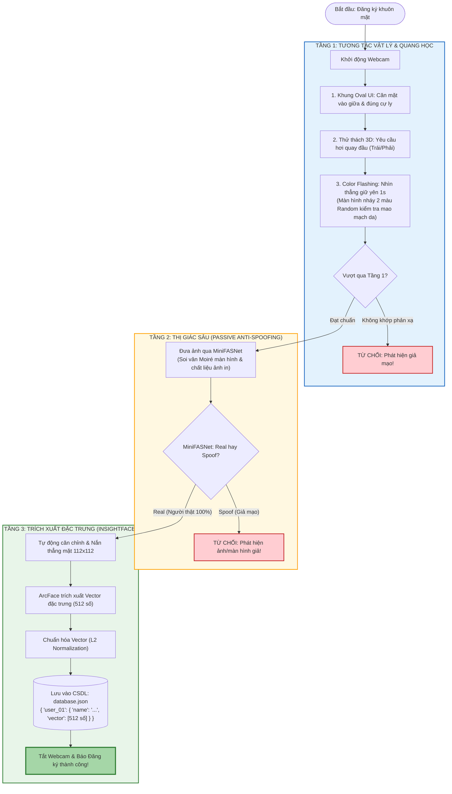
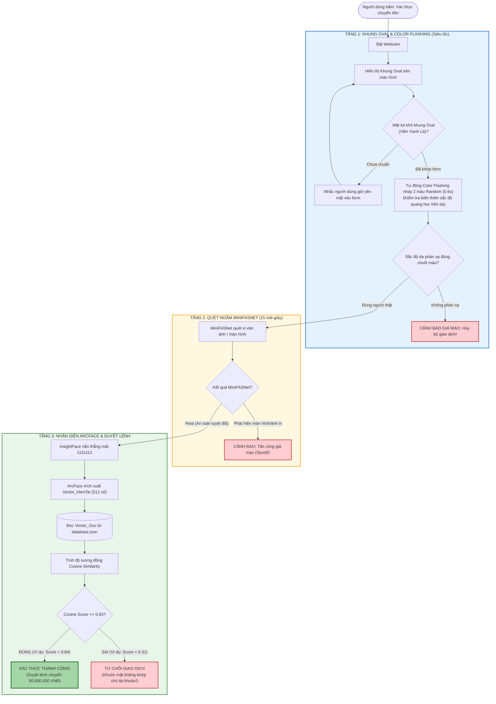

# HỆ THỐNG PIPELINE eKYC CHUẨN 3 TẦNG BẢO MẬT (DEFENSE IN DEPTH)
> **Kiến trúc hoàn chỉnh: Tầng 1 (Tương tác & Color Flashing) -> Tầng 2 (MiniFASNet) -> Tầng 3 (ArcFace / InsightFace)**

---

## 1. SƠ ĐỒ GIAI ĐOẠN 1: ĐĂNG KÝ KHUÔN MẶT (ENROLLMENT)
> **Mục tiêu:** Kiểm tra kỹ lưỡng 3 tầng một lần duy nhất để lưu lại "vector 512 số sạch nhất" của người dùng vào `database.json`.

---

## 2. SƠ ĐỒ GIAI ĐOẠN 2: XÁC THỰC CHUYỂN TIỀN (VERIFICATION)
> **Mục tiêu:** Xác thực cực nhanh (dưới 2 giây), người dùng chỉ cần giữ yên mặt trong khung Oval, hệ thống tự nháy màu và quét ngầm 3 tầng để duyệt lệnh.

---

## 3. BẢNG PHÂN CÔNG 3 TẦNG BẢO MẬT (DÙNG ĐỂ THUYẾT TRÌNH)

| Tầng | Tên Tầng Bảo Mật | Công Nghệ Sử Dụng | Nhiệm Vụ Cụ Thể | Loại Tấn Công Bị Chặn |
| :---: | :--- | :--- | :--- | :--- |
| **TẦNG 1** | **Tương tác & Quang học** | Khung Oval UI + Random Color Flashing | Kiểm tra góc quay mặt 3D và sự thay đổi màu sắc quang học mao mạch da dưới ánh sáng ngẫu nhiên | Chặn ảnh chụp 2D bất động, ảnh giấy không phản xạ da |
| **TẦNG 2** | **Thị giác sâu chống giả mạo** | Mô hình **MiniFASNet** (Silent-Face-Anti-Spoofing) | Soi các chi tiết vi mô: vân Moiré của màn hình điện thoại/iPad, độ chói bóng của mặt kính, kết cấu bề mặt | Chặn video quay lén phát lại trên điện thoại/máy tính bảng, ảnh in chất lượng cao |
| **TẦNG 3** | **Định danh sinh trắc học** | Mô hình **ArcFace** (thư viện **InsightFace**) | Nắn thẳng mặt $112 \times 112$, trích xuất 512 số đặc trưng và so sánh Cosine Similarity với ngưỡng $\ge 0.65$ | Chặn người lạ, chỉ cho phép đúng chủ tài khoản thực hiện giao dịch |
