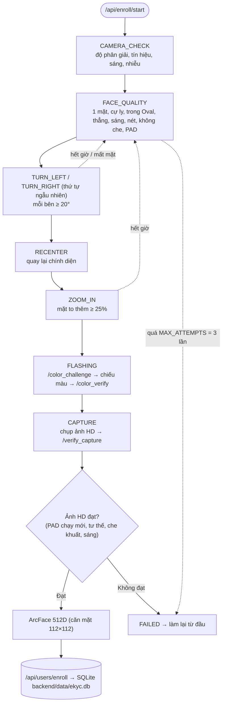
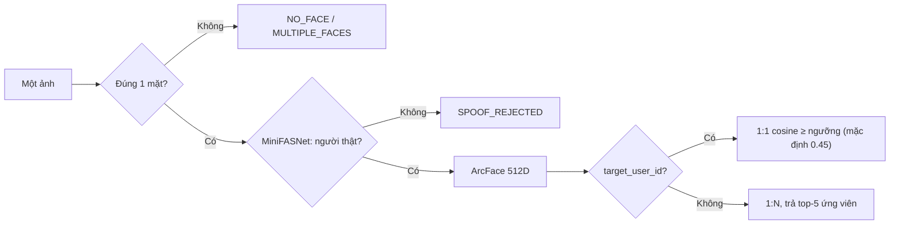

# Pipeline eKYC (hiện trạng branch `quoc`)

Hai luồng: **đăng ký** (nhiều bước, chạy trên luồng video) và **xác thực** (một ảnh). Các ngưỡng nằm trong
`backend/config.py`. Những gì chưa làm xem ở [ROADMAP.md](ROADMAP.md).

## 1. Đăng ký

Trình duyệt gửi từng frame (đã lật gương) lên `/api/enroll/frame`. Mỗi frame, backend chạy kiểm tra camera,
MediaPipe FaceMesh (+ Hands mỗi 2 frame), MiniFASNet (mỗi 3 frame, trung bình 5 lần gần nhất) và
`evaluate_face` một lần, rồi máy trạng thái trong `enrollment.py` quyết định bước tiếp theo.

Giả mạo (MiniFASNet báo ảnh in hoặc màn hình) bị chặn ở mọi bước, kể cả CAMERA_CHECK.

## 2. Xác thực (`/api/verify/face`)

Luồng xác thực hiện chưa có thử thách chủ động (nháy màu / quay đầu) như luồng đăng ký.

## 3. Các tầng phòng thủ

| Tầng | Công nghệ | Trạng thái |
| --- | --- | --- |
| Thử thách chủ động | Quay đầu ngẫu nhiên, tiến gần, nháy màu | Chỉ có ở luồng đăng ký |
| Chống giả mạo thụ động | MiniFASNetV2 (ONNX) | Bật. Thiếu model thì từ chối |
| Heuristic bổ sung | Độ sâu Z, vân Moiré, viền thiết bị | Có code, mặc định tắt (`ANTISPOOF_USE_*`) |
| Nhận diện | ArcFace w600k_r50 (ONNX) + cosine | Bật. Ngưỡng chưa hiệu chỉnh trên dữ liệu thật |
