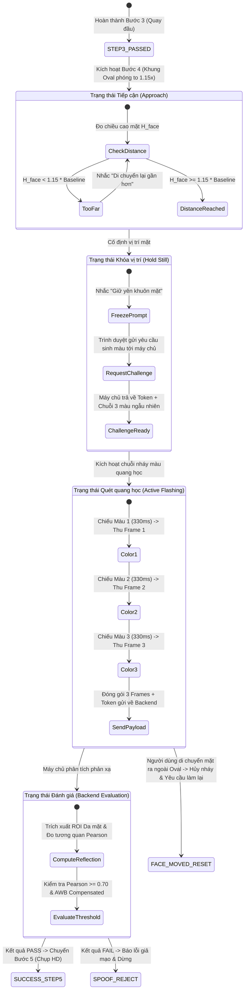

# PRD: ACTIVE OPTICAL COLOR FLASHING LIVENESS DETECTION (PHASE 1)

> **Ghi chú trạng thái (branch `quoc`):** Đây là tài liệu thiết kế mục tiêu, có thể không khớp với code hiện tại. Hiện trạng xem [README.md](README.md) và [PIPELINE.md](PIPELINE.md); phần chưa làm xem [ROADMAP.md](ROADMAP.md).

> **Tài liệu Đặc tả Yêu cầu Sản phẩm (Product Requirements Document)**  
> **Tính năng:** Xác thực sự sống bằng phản xạ ánh sáng màu chủ động (Color Flashing)  
> **Vị trí tích hợp:** Bước 4 - "Tiến gần & Quét quang học" (Zoom & Optical Liveness)  
> **Phiên bản:** 1.0.0  
> **Tiêu chuẩn tuân thủ:** ASD-STE100, W3C WCAG 2.1 (Photosensitive Safety), ISO/IEC 30107-3 (Presentation Attack Detection)  
> **Tác giả:** Ban Kỹ Thuật (Mini Engineering Board)

---

## 1. CHÂN DUNG NGƯỜI DÙNG & TÌNH HUỐNG SỬ DỤNG (USER PERSONAS & SCENARIOS)

### 1.1. Chân dung người dùng hợp lệ (Persona 1: Nguyễn Văn Thật - Khách hàng mở tài khoản)
- **Thiết bị:** Laptop hoặc máy tính bàn có Webcam USB / Camera tích hợp (độ phân giải 720p - 1080p).
- **Môi trường:** Phòng làm việc, ánh sáng đèn huỳnh quang hoặc ánh sáng ban ngày gián tiếp.
- **Hành vi:** Người dùng làm theo chỉ dẫn trên màn hình. Khi màn hình yêu cầu tiến gần, người dùng đưa mặt lại gần cự ly $25\text{ cm} - 35\text{ cm}$. Màn hình phát sáng chuỗi màu nhẹ nhàng trong $1.0\text{ giây}$. Người dùng không bị chói mắt và hoàn tất quy trình trong 2 giây.

### 1.2. Chân dung kẻ tấn công phát lại màn hình (Persona 2: Trần Tấn Công - Replay Attacker)
- **Thiết bị tấn công:** Máy tính bảng iPad Pro màn hình OLED 120Hz hoặc điện thoại iPhone phát video khuôn mặt của người thật đã ghi hình từ trước.
- **Thủ đoạn:** Đặt màn hình iPad trước webcam và bấm phát video. Video có động tác quay đầu khớp với Bước 3.
- **Phản ứng của hệ thống tại Bước 4:** Khi hệ thống phát chuỗi ánh sáng màu ngẫu nhiên (ví dụ: Xanh lá $\rightarrow$ Đỏ $\rightarrow$ Xanh dương), màn hình iPad không thể phản xạ màu sắc này vì bề mặt kính iPad có lớp phân cực và điểm ảnh tự phát sáng độc lập. Hệ thống phát hiện độ lệch màu không khớp và từ chối phiên đăng ký ngay lập tức.

### 1.3. Chân dung kẻ tấn công mặt nạ 3D (Persona 3: Lê Giả Mạo - 3D Mask Attacker)
- **Thiết bị tấn công:** Mặt nạ nhựa in 3D hoặc mặt nạ silicon tái tạo hình khối khuôn mặt.
- **Thủ đoạn:** Kẻ tấn công đeo mặt nạ để vượt qua bài kiểm tra độ sâu hình học MediaPipe Z-depth.
- **Phản ứng của hệ thống tại Bước 4:** Silicon và nhựa có chỉ số khúc xạ và phổ tán xạ quang học khác biệt hoàn toàn so với mô da người chứa huyết cầu tố (hemoglobin). Hệ thống phát hiện hệ số tương quan quang học không đạt ngưỡng và phát cảnh báo gian lận.

### 1.4. Chân dung kẻ tấn công tiêm luồng video (Persona 4: Hoàng Hacker - Virtual Camera Injection)
- **Thiết bị tấn công:** Phần mềm giả lập Webcam (OBS Virtual Camera, ManyCam) tiêm thẳng luồng video số vào trình duyệt.
- **Thủ đoạn:** Không sử dụng camera quang học vật lý, luồng video nạp trực tiếp qua API trình duyệt.
- **Phản ứng của hệ thống tại Bước 4:** Do luồng video được phát từ tệp video số cố định, nó hoàn toàn không có bất kỳ phản hồi quang học nào tương ứng với chuỗi màu sắc ngẫu nhiên mà máy chủ vừa phát sinh cho phiên đó. Hệ thống khóa phiên đăng ký sau $1.0\text{ giây}$.

---

## 2. LUỒNG NGƯỜI DÙNG TÍCH HỢP (INTEGRATED USER FLOW: STEP 4)

Ban Kỹ Thuật tích hợp Color Flashing trực tiếp vào Bước 4: **"Tiến gần & Quét quang học"**.

---

## 3. THIẾT KẾ TRẢI NGHIỆM VẬT LÝ & AN TOÀN THỊ GIÁC (PHYSICAL UX & SAFETY)

### 3.1. Tuân thủ tiêu chuẩn an toàn thị giác W3C WCAG 2.1 (Success Criterion 2.3.1)
- **Quy tắc ba lần chớp (Three Flashes Rule):** Nội dung thị giác không được chớp vượt quá 3 lần trong khoảng thời gian 1 giây.
- **Áp dụng cho eKYC:** 
  - Hệ thống chỉ chiếu đúng **3 màu liên tiếp**.
  - Mỗi màu hiển thị trong thời gian $330\text{ ms} - 350\text{ ms}$.
  - Tổng thời gian chiếu: $1000\text{ ms} \pm 50\text{ ms}$ (tần số tương đương $1\text{ Hz}$, nằm sâu dưới ngưỡng nguy hiểm $3\text{ Hz}$).

### 3.2. Thiết kế Lớp phủ Quang học An toàn (Safe Optical Flashing Overlay)
- **Kỹ thuật phát quang không chói mắt:**
  - Không phủ màu trắng chói $100\%$ lên toàn màn hình.
  - Sử dụng hiệu ứng **Radial Glow Overlay**: Vùng viền Oval và ngoại vi màn hình phát màu cường độ cao ($80\%$), trong khi vùng trung tâm đôi mắt giữ độ mờ dịu ($\alpha = 0.40 - 0.50$). Ánh sáng phản xạ đủ chiếu sáng vùng trán và gò má nhưng không làm lóa đồng tử mắt.
- **Bảng 5 màu quang học tiêu chuẩn:**
  1. `EMERALD_GREEN`: `#00E676` (Bước sóng $\approx 520\text{ nm}$ - Phản xạ mạnh trên mao mạch da).
  2. `CORAL_RED`: `#FF3D00` (Bước sóng $\approx 630\text{ nm}$ - Hấp thụ bởi oxyhemoglobin).
  3. `SKY_BLUE`: `#2979FF` (Bước sóng $\approx 460\text{ nm}$ - Đo độ tán xạ bề mặt lớp sừng).
  4. `AMBER_YELLOW`: `#FFC400` (Bước sóng $\approx 580\text{ nm}$ - Tạo độ tương phản sắc độ).
  5. `MAGENTA_PINK`: `#F50057` (Phối hợp phổ Đỏ + Xanh dương kiểm tra phân cực màn hình giả).

---

## 4. BẢNG MÁY TRẠNG THÁI GIAO DIỆN CHI TIẾT (UI STATE MACHINE SPECIFICATION)

Với Component Bước 4 ("Tiến gần & Quét quang học"), hệ thống định nghĩa 7 trạng thái rõ ràng:

| Mã Trạng Thái | Tên Trạng Thái | Điều Kiện Kích Hoạt | Hành Động Hệ Thống | Phản Hồi Thị Giác (UI Visual Feedback) |
| :--- | :--- | :--- | :--- | :--- |
| `ST_401` | `APPROACH_WAIT` | Hoàn thành Bước 3 | Mở rộng viền Oval thêm $15\%$. Bắt đầu đo kích thước mặt $H_{face}$. | Viền Oval màu xanh dương nét đứt. Dòng chữ: "Tiến lại gần màn hình". |
| `ST_402` | `APPROACH_ALIGNED` | $H_{face} \ge 1.15 \times H_0$ và tâm mặt $\le 10\%$ tâm Oval | Bắt đầu đếm ổn định $300\text{ ms}$. Gửi API lấy chuỗi màu. | Viền Oval chuyển sang màu vàng hổ phách. Dòng chữ: "Giữ yên khuôn mặt". |
| `ST_403` | `FLASH_SEQUENCE` | Nhận được chuỗi màu từ Backend và mặt giữ yên | Trình duyệt đổi màu nền theo 3 nhịp ($330\text{ ms}$/màu). Thu 3 frame tương ứng. | Viền phát sáng đổi màu đồng bộ (Màu 1 -> 2 -> 3). Vòng tiến trình tròn chạy $0\% \to 100\%$. |
| `ST_404` | `FLASH_ANALYZING` | Đã thu đủ 3 frames và gửi dữ liệu lên máy chủ | Trình duyệt hiển thị vòng xoay xử lý. Chờ Backend phản hồi $\le 400\text{ ms}$. | Viền Oval màu xanh cyan xoay tròn nhẹ. Dòng chữ: "Đang phân tích phản xạ...". |
| `ST_405` | `FLASH_SUCCESS` | Backend trả về `optical_liveness = PASS` | Chốt kết quả Bước 4 đạt chuẩn. Kích hoạt chuyển sang Bước 5. | Viền Oval chuyển màu xanh lá rực rỡ. Âm thanh bíp ngắn xác nhận. |
| `ST_406` | `ERR_FACE_LOST` | Mặt rời khỏi khung Oval trong khi đang chiếu màu | Lập tức hủy chuỗi màu. Đặt lại trạng thái `ST_401`. | Viền Oval nháy đỏ 1 lần. Dòng chữ: "Không di chuyển mặt khi quét". |
| `ST_407` | `ERR_SPOOF_DETECTED`| Backend trả về `optical_liveness = FAIL` | Khóa phiên giao dịch. Không cấp phép chụp ảnh. | Viền Oval đỏ toàn phần. Thông báo: "Xác thực không thành công. Vui lòng thử lại". |

---

## 5. THÔNG BÁO VÀ HƯỚNG DẪN NGƯỜI DÙNG THEO CHUẨN ASD-STE100

Tuân thủ nguyên tắc: **Một từ = Một nghĩa. Câu chủ động. Tách biệt Điều kiện (If) và Hành động (Then). Tuyệt đối không dùng từ mơ hồ.**

| Tình Huống Kỹ Thuật | Thông Báo Cũ (Mơ Hồ) | Thông Báo Mới (Chuẩn ASD-STE100) | Tác Nhân & Hành Động |
| :--- | :--- | :--- | :--- |
| Mặt còn ở xa màn hình | *Bạn hãy vui lòng tiến lại gần một chút nhé* | **Di chuyển khuôn mặt lại gần camera.** | [Người dùng] + [Di chuyển] + [Khuôn mặt] |
| Mặt đã vào đúng cự ly gần | *Chuẩn bị quét ánh sáng giữ mặt tốt nhé* | **Giữ yên khuôn mặt trong khung.** | [Người dùng] + [Giữ yên] + [Khuôn mặt] |
| Đang phát sáng quét quang học | *Đang xử lý nháy màu...* | **Nhìn thẳng vào màn hình.** | [Người dùng] + [Nhìn thẳng] + [Màn hình] |
| Mặt bị lệch trong lúc flash | *Mặt bạn bị lệch rồi làm lại đi* | **Đưa khuôn mặt vào giữa khung và thử lại.** | [Người dùng] + [Đưa] + [Khuôn mặt] |
| Phát hiện màn hình/ảnh in | *Có thể bạn đang dùng ảnh giả hoặc video* | **Xác thực thất bại. Hệ thống phát hiện bề mặt không hợp lệ.** | [Hệ thống] + [Phát hiện] + [Bề mặt] |
| Hết thời gian thực hiện | *Hết giờ xử lý rồi* | **Hết thời gian. Bấm nút Bắt đầu để làm lại.** | [Người dùng] + [Bấm] + [Nút Bắt đầu] |

---

## 6. CƠ CHẾ NGĂN NGỪA LỖI & PHẢN HỒI TỨC THÌ (ERROR PREVENTION & FEEDBACK)

1. **Ngăn ngừa chói mắt đột ngột:** Ánh sáng chuyển màu sử dụng hàm chuyển tiếp mượt CSS `transition: background-color 80ms ease-in-out` thay vì đổi giật cục trong 0ms.
2. **Cơ chế ngắt tự động (Fail-safe Interruption):** Nếu người dùng nhắm mắt hoặc quay đầu đi trong khi đang nháy màu, Face Mesh phát hiện mất mốc mắt $\implies$ Trình duyệt tự động tắt màn hình flash ngay tại mili-giây thứ $10$ để bảo vệ người dùng và tránh gửi khung hình hỏng lên máy chủ.
3. **Phản hồi tiến trình trực quan:** Khung Oval có thanh tiến trình viền chạy mượt mà từ $0\%$ đến $100\%$ trong suốt $1.0\text{ giây}$ để người dùng biết chính xác thời gian cần giữ yên.

---

## 7. TIÊU CHÍ NGHIỆM THU PHASE 1 (PRD ACCEPTANCE CRITERIA)

- [x] Định nghĩa đầy đủ 4 chân dung người dùng (Nguyễn Văn Thật, Replay Attacker, Mask Attacker, Video Injection Attacker).
- [x] Tích hợp mạch lạc vào Bước 4 hiện tại ("Tiến gần & Quét quang học").
- [x] Thiết lập State Machine giao diện với 7 trạng thái chi tiết kèm điều kiện chuyển đổi và phản hồi thị giác.
- [x] Đạt chuẩn an toàn thị giác W3C WCAG 2.1 (Tần số $< 3\text{ Hz}$, bảng 5 màu dịu, thiết kế Radial Glow Overlay).
- [x] Biên soạn $100\%$ thông báo người dùng theo quy tắc ASD-STE100.

---
*Tài liệu PRD hoàn thành. Ban Kỹ Thuật chờ phê duyệt để chuyển sang Phase 2: FSD.*
