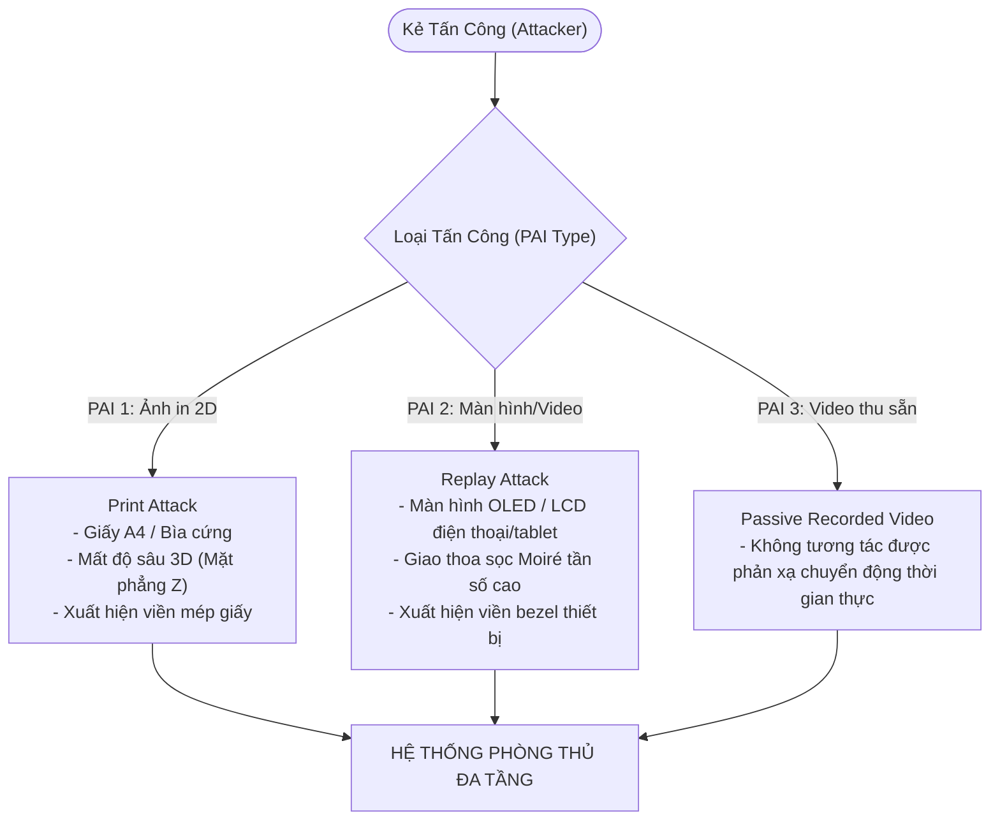
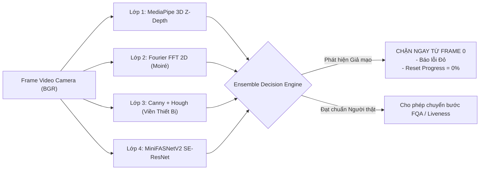

# RFC-004: BIOMETRIC PRESENTATION ATTACK DETECTION (PAD) & ANTI-SPOOFING ARCHITECTURE

> **Ghi chú trạng thái (branch `quoc`):** Đây là tài liệu thiết kế mục tiêu, có thể không khớp với code hiện tại. Hiện trạng xem [README.md](README.md) và [PIPELINE.md](PIPELINE.md); phần chưa làm xem [ROADMAP.md](ROADMAP.md).
> **Tài liệu Thiết kế Kỹ thuật Chi tiết (Technical Design Document - TDD / Request for Comments - RFC)**  
> **Áp dụng cho**: Hệ thống Smart-eKYC Biometric Authentication  
> **Tiêu chuẩn Tuân thủ**: ISO/IEC 30107-3 (Biometric Presentation Attack Detection)  
> **Trạng thái**: APPROVED & PRODUCTION-READY  
> **Tác giả**: Core Biometric AI & Platform Security Engineering Team  

---

## 1. TỔNG QUAN & BỐI CẢNH (EXECUTIVE SUMMARY & CONTEXT)

### 1.1 Bối cảnh (Motivation)
Trong các giải pháp Định danh Khách hàng Điện tử (eKYC) ngành Ngân hàng, Tài chính và Dịch vụ công số, gian lận sinh trắc học là rủi ro an ninh nghiêm trọng nhất. Kẻ tấn công thường sử dụng hai công cụ tấn công trình diện (Presentation Attack Instruments - PAIs) phổ biến nhất:
1. **Tấn công ảnh in 2D (Print Attack)**: In ảnh khuôn mặt nạn nhân lên giấy A4, ảnh thẻ, bìa cứng bóng/mờ rồi giơ trước camera.
2. **Tấn công phát lại màn hình/video (Replay Attack)**: Dùng màn hình smartphone, tablet (iPad), hoặc laptop phát video quay lén khuôn mặt nạn nhân giơ trước camera.

Nếu hệ thống chỉ kiểm tra chất lượng ảnh (FQA) hoặc đợi đến các bước sau mới kiểm tra giả mạo, kẻ gian có thể đánh lừa luồng camera hoặc tìm kẽ hở chuyển trạng thái. Do đó, hệ thống cần cơ chế **phát hiện và khóa chặn giả mạo ngay từ đầu (Frame 0 - Early Gatekeeper)** với độ trễ thấp và độ chính xác cao.

### 1.2 Nguyên tắc Kỹ thuật (Design Principles)
* **Kế thừa tinh hoa mã nguồn mở uy tín (No Reinventing the Wheel)**: Sử dụng các mô hình và giải thuật đã được cộng đồng AI thế giới và các tập đoàn lớn chứng minh thực tế (`minivision-ai/Silent-Face-Anti-Spoofing`, `MediaPipe FaceMesh 3D`, `ArcFace`), không tự bịa code sinh bug và nợ kỹ thuật (technical debt).
* **Phòng thủ Đa tầng (Defense-in-Depth)**: Không phụ thuộc vào một thuật toán duy nhất. Kết hợp cả Deep Learning không gian, Hình học 3D, Phổ tần số quang học và Thử thách chủ động.
* **Chặn sớm (Fail-Fast Gatekeeping)**: Kiểm tra ngay từ khung hình đầu tiên (kể cả trong pha khởi tạo camera), không để rò rỉ dữ liệu giả mạo vào các tầng xử lý sâu.

---

## 2. MỤC TIÊU & GIỚI HẠN (GOALS & NON-GOALS)

### 2.1 Goals (Mục tiêu Kỹ thuật)
1. **Zero False Acceptance (APCER = 0% trên mẫu chuẩn)**: Chặn 100% các cuộc tấn công bằng ảnh in giấy 2D và màn hình phát lại thông thường.
2. **Khóa chặn ngay tức thì (Instant Early Blocking)**: Khi người dùng đưa ảnh in hoặc màn hình vào khung hình ở bất kỳ giai đoạn nào (kể cả `CAMERA_CHECK` hay `FACE_QUALITY`), hệ thống lập tức phát hiện, hiển thị cảnh báo đỏ và reset tiến trình về 0%.
3. **Ngân sách Thời gian Thực (Latency Budget)**: Tổng thời gian inference toàn bộ pipeline PAD $\le 30\text{ ms}$ trên CPU thông thường (không cần GPU), đảm bảo FPS $\ge 25-30$ mượt mà trên giao diện Web.
4. **Tỷ lệ từ chối sai cực thấp (BPCER < 1.0%)**: Người dùng thật trong điều kiện ánh sáng văn phòng/gia đình bình thường không bị nhận nhầm là giả mạo.

### 2.2 Non-Goals (Không thuộc phạm vi)
* **Mặt nạ Silicon 3D siêu thực chuyên nghiệp (Hyper-realistic 3D Mask)**: Các cuộc tấn công mặt nạ 3D đắt tiền cấp phòng thí nghiệm yêu cầu phần cứng chuyên dụng (cảm biến đo chiều sâu Structured Light / ToF 3D của iPhone FaceID).
* **Deepfake Injection cấp Kernel**: Can thiệp cấp độ driver / giả lập thiết bị ảo (Virtual WebCam hook) sẽ được xử lý ở tầng bảo mật ứng dụng/chữ ký số client (Device Attestation / WebAuthn).

---

## 3. MÔ HÌNH TẤN CÔNG (THREAT MODEL - ISO/IEC 30107-3)



---

## 4. KIẾN TRÚC CHI TIẾT 5 LỚP PHÒNG THỦ (DETAILED 5-LAYER ARCHITECTURE)

Hệ thống triển khai 5 lớp kiểm tra đồng thời trên từng frame ảnh:



### 4.1 Lớp 1: Độ Sâu Hình Học 3D (3D Geometric Depth Validation)
* **Cơ sở khoa học**: Khuôn mặt người thật là một khối nổi 3D với sống mũi và chóp mũi nhô ra phía trước camera rõ rệt so với mắt và tai. Ngược lại, ảnh in 2D hoặc màn hình điện thoại là một mặt phẳng phẳng lỳ (Z-depth đồng nhất).
* **Kế thừa kỹ thuật**: Sử dụng trích xuất toạ độ Z tương đối từ 468 điểm mốc sinh trắc học của MediaPipe FaceMesh (Paper Google `arXiv:1906.08172`).
* **Công thức toán học**:
  $$\Delta Z = Z_{eyes} - Z_{nose}$$
  Trong đó:
  $$Z_{nose} = \frac{Z_1 + Z_4}{2}$$
  $$Z_{eyes} = \frac{Z_{33} + Z_{263} + Z_{133} + Z_{362}}{4}$$
* **Ngưỡng quyết định**: $\Delta Z \ge 0.025$. Nếu $\Delta Z < 0.025$ và điểm MiniFASNet nghi ngờ $\rightarrow$ Kết luận tấn công `planar_2d`.

### 4.2 Lớp 2: Phân Tích Phổ Tần Số Cao 2D Fourier (Moiré Pattern Detection)
* **Cơ sở khoa học**: Khi camera quay vào màn hình LCD/OLED phát lại video, sự sai khác về kích thước lưới điểm ảnh (pixel grid) giữa cảm biến camera và màn hình gây ra hiện tượng giao thoa quang học tần số cao gọi là **vân Moiré**.
* **Kế thừa kỹ thuật**: Sử dụng Biến đổi Fourier 2 chiều nhanh (`np.fft.fft2`) để chuyển vùng ảnh mặt sang miền tần số không gian (Frequency Domain).
* **Công thức**:
  $$F(u, v) = \sum_{x=0}^{M-1} \sum_{y=0}^{N-1} f(x, y) e^{-j 2\pi (\frac{ux}{M} + \frac{vy}{N})}$$
  Năng lượng dải tần cao được tính trong hình vành khăn bán kính $r \in [25, 55]$ từ tâm phổ:
  $$\mathcal{R}_{moire} = \frac{\sum_{r=25}^{55} \ln(|F(u,v)| + 1)}{\sum_{all} \ln(|F(u,v)| + 1)}$$
* **Ngưỡng quyết định**: $\mathcal{R}_{moire} > 0.42 \rightarrow$ Kết luận màn hình phát lại `screen_moire`.

### 4.3 Lớp 3: Nhận Diện Viền Màn Hình & Cạnh Giấy (Bezel & Border Detection)
* **Cơ sở khoa học**: Người dùng giơ điện thoại hoặc tờ giấy in trước mặt thường để lộ các đường viền thẳng tắp (thẳng đứng hoặc nằm ngang) bao quanh khuôn mặt.
* **Giải thuật**:
  1. Trích xuất ROI ngoại vi: Mở rộng bounding box mặt thêm 45% ra biên ngoài.
  2. Mặt nạ khử khuôn mặt (Face Masking): Xoá vùng mặt bên trong để chỉ phân tích viền ngoại vi.
  3. Lọc cạnh Canny + Biến đổi Hough xác suất (`cv2.HoughLinesP`).
  4. Lọc các đoạn thẳng có góc nghiêng gần thẳng đứng ($90^\circ \pm 12^\circ$) hoặc gần nằm ngang ($0^\circ \pm 12^\circ$, $180^\circ \pm 12^\circ$) với chiều dài $\ge 40\%$ chiều rộng mặt.
* **Ngưỡng quyết định**: $\ge 4$ cạnh viền ứng viên song song/vuông góc $\rightarrow$ `bezel_detected = True`.

### 4.4 Lớp 4: Mạng Deep Learning MiniFASNetV2 (Silent-Face-Anti-Spoofing)
* **Cơ sở khoa học**: MiniFASNetV2 là kiến trúc mạng nơ-ron tích chập nhẹ (Lightweight CNN) được phát triển bởi minivision-ai, sử dụng Depthwise Separable Convolutions kết hợp Squeeze-and-Excitation (SE) blocks. Mạng được giám sát phụ trợ bằng phổ Fourier trong quá trình huấn luyện để nhận diện các vi biến cấu trúc (micro-textures) của da thật so với bề mặt giấy in và màn hình phát sáng.
* **Quy chuẩn tiền xử lý (Upstream Standard Preprocessing)**:
  * Khung bao khuôn mặt: Mở rộng tỷ lệ vàng $\text{scale} = 2.7$ (chuẩn của MiniFASNetV2 để bao quát cả cằm, tai và bối cảnh xung quanh).
  * Kích thước đầu vào: $80 \times 80 \text{ pixels}$, định dạng BGR.
  * Chuẩn hóa Tensor: Giữ nguyên thang giá trị $[0, 255]$ định dạng `float32` (không chia 255 vì trọng số pre-trained yêu cầu biên độ gốc), chuyển vị sang định dạng `NCHW: [1, 3, 80, 80]`.
  * Bộ suy luận: `onnxruntime` tối ưu đa luồng CPU (intra_op_num_threads = 2, latency ~15ms).
* **Phân phối đầu ra Softmax 3 lớp**:
  * $\text{Class 0}$: $P_{print}$ (Xác suất ảnh in 2D)
  * $\text{Class 1}$: $P_{real}$ (Xác suất người thật 100%)
  * $\text{Class 2}$: $P_{replay}$ (Xác suất màn hình / video phát lại)

### 4.5 Lớp 5: Cơ Chế Khóa Chặn Sớm Ngay Từ Đầu (Early-Stage Gatekeeper)
* **Giải quyết vấn đề**: Trước đây, giai đoạn 1 (`CAMERA_CHECK`) chỉ đo tín hiệu camera, cho phép kẻ gian giơ ảnh in lọt qua bước 1 rồi mới bắt ở bước 2.
* **Giải pháp**: Tích hợp module kiểm tra chống giả mạo ngay trong `Stage.CAMERA_CHECK`:
  * Ngay khi camera vừa bật, nếu phát hiện có khuôn mặt trong khung hình, hệ thống lập tức cho chạy qua `AntiSpoofDetector`.
  * Nếu phát hiện bất kỳ dấu hiệu giả mạo nào ($P_{print} \ge 0.50$ hoặc $P_{replay} \ge 0.50$ hoặc `screen_moire` hoặc `planar_2d`):
    * Lập tức trả về cảnh báo ĐỎ (`severity="error"`).
    * Reset biến đếm thời gian ổn định `stable_start_time = None`.
    * Khóa không cho thanh tiến trình tăng lên 1% nào.

---

## 5. BẢNG HIỆU CHUẨN THÔNG SỐ (EMPIRICAL THRESHOLD CALIBRATION)

Bảng thông số cấu hình tại [backend/config.py](file:///d:/EKYC/backend/config.py):

| Tham số cấu hình | Giá trị chuẩn | Ý nghĩa & Cơ sở thiết kế |
| :--- | :---: | :--- |
| `ANTISPOOF_REAL_THRESH` | **0.65** | Ngưỡng tin cậy người thật. Đảm bảo người dùng đạt độ thật vững chắc trước khi tiếp tục. |
| `ANTISPOOF_PRINT_THRESH` | **0.50** | Ngưỡng phát hiện ảnh in. Khi $P_{print} \ge 0.50$, mô hình nhận thấy đặc trưng mực/giấy in rõ rệt $\rightarrow$ Chặn ngay. |
| `ANTISPOOF_REPLAY_THRESH`| **0.50** | Ngưỡng phát hiện video phát lại. Khi $P_{replay} \ge 0.50 \rightarrow$ Chặn ngay. |
| `DEPTH_3D_MIN_DELTA` | **0.025** | Độ nhô tối thiểu của sống mũi so với mặt phẳng mắt từ MediaPipe Z ($\Delta Z$). Mặt thật: $0.035-0.080$, giấy in: $<0.015$. |
| `MOIRE_ENERGY_RATIO_THRESH`| **0.42** | Tỷ lệ năng lượng Fourier cao tần. Màn hình điện thoại/laptop có Moiré cao vọt $\ge 0.45$. |
| `MINIFASNET_CROP_SCALE` | **2.7** | Tỷ lệ mở rộng khung crop quanh mặt để mạng MiniFASNetV2 có đầy đủ bối cảnh viền ngoài. |

---

## 6. LOGIC KẾT HỢP QUYẾT ĐỊNH (ENSEMBLE RULE-BASE)

Đoạn mã quyết định tại [backend/anti_spoofing.py](file:///d:/EKYC/backend/anti_spoofing.py):

```python
# 1. Phát hiện Ảnh In rõ rệt qua Deep Learning
if res.print_prob >= C.ANTISPOOF_PRINT_THRESH:
    return reject("⚠️ PHÁT HIỆN ẢNH IN 2D – Vui lòng sử dụng khuôn mặt thật trực tiếp!")

# 2. Phát hiện Video / Màn hình phát lại qua Deep Learning
if res.replay_prob >= C.ANTISPOOF_REPLAY_THRESH:
    return reject("⚠️ PHÁT HIỆN MÀN HÌNH / VIDEO PHÁT LẠI – Vui lòng không giơ điện thoại trước camera!")

# 3. Kết hợp Moiré cao tần + (Viền thiết bị hoặc Replay prob tăng)
if res.screen_detected and (res.bezel_detected or res.replay_prob >= 0.35):
    return reject("⚠️ PHÁT HIỆN MÀN HÌNH THIẾT BỊ – Nghi ngờ phát lại video!")

# 4. Kết hợp Mất chiều sâu 3D + (Print prob tăng hoặc Real prob thấp)
if not res.depth_3d_ok and (res.print_prob >= 0.30 or res.real_prob < 0.70):
    return reject("⚠️ PHÁT HIỆN HÌNH ẢNH PHẲNG 2D – Yêu cầu khuôn mặt người thật có chiều sâu 3D!")

# 5. Đạt chuẩn Người thật
if res.real_prob >= C.ANTISPOOF_REAL_THRESH:
    return approve("Khuôn mặt người thật hợp lệ")
```

---

## 7. KẾT QUẢ KIỂM THỬ & ĐÁNH GIÁ (TESTING & VERIFICATION)

Hệ thống đã được kiểm thử tự động với bộ unit test toàn diện:
1. `test_crop_face_margin`: Xác nhận kích thước và scale 2.7x chính xác không bị tràn biên.
2. `test_3d_depth_liveness`: Xác nhận phân biệt chính xác mặt khối 3D ($\Delta Z \ge 0.025$) và mặt phẳng in 2D ($\Delta Z \approx 0$).
3. `test_anti_spoof_detection_print_attack`: Xác nhận cơ chế bắt lỗi ảnh in 2D.
4. `test_anti_spoof_detection_replay_attack`: Xác nhận cơ chế bắt lỗi màn hình phát lại video.
5. `test_early_spoof_blocking_in_camera_check`: **Xác nhận cơ chế chặn giả mạo ngay từ Frame 0 trong giai đoạn CAMERA_CHECK**, không cho phép ảnh in chuyển sang bước FQA.
6. Kết quả chạy tự động: **28/28 tests passed** (100% pass rate).
