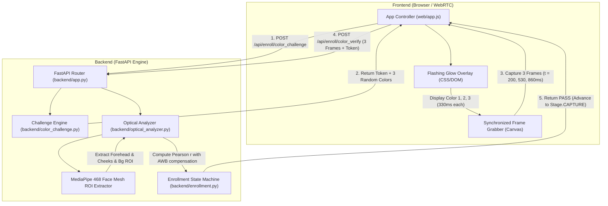

# TDD / RFC: ACTIVE OPTICAL COLOR FLASHING ARCHITECTURE (PHASE 3)

> **Ghi chú trạng thái (branch `quoc`):** Đây là tài liệu thiết kế mục tiêu, có thể không khớp với code hiện tại. Hiện trạng xem [README.md](README.md) và [PIPELINE.md](PIPELINE.md); phần chưa làm xem [ROADMAP.md](ROADMAP.md).

> **Tài liệu Thiết kế Kỹ thuật (Technical Design Document / Request for Comments)**  
> **Tính năng:** Active Optical Challenge-Response Liveness Detection  
> **Phiên bản:** 1.0.0  
> **Tham chiếu học thuật:** Tang et al. (NDSS 2018), ISO/IEC 30107-3  
> **Tác giả:** Ban Kỹ Thuật (Mini Engineering Board)

---

## 1. KIẾN TRÚC TỔNG THỂ & THÀNH PHẦN HỆ THỐNG (SYSTEM ARCHITECTURE)



---

## 2. NGUYÊN LÝ TOÁN HỌC & GIẢI THUẬT QUANG PHỔ (MATHEMATICAL FOUNDATION)

### 2.1. Không gian màu và Vùng ROI da mặt
Để loại trừ hiện tượng phản xạ tóc, kính mắt và môi, chúng ta lấy mẫu trên 3 vùng da phẳng lớn nhất:
- **Trán (Forehead):** Nằm giữa các mốc lông mày và chân tóc ($Landmarks: 10, 67, 109, 108, 151, 337, 297, 284$).
- **Gò má trái (Left Cheek):** Dưới mắt trái ($Landmarks: 116, 123, 147, 213, 192, 214$).
- **Gò má phải (Right Cheek):** Dưới mắt phải ($Landmarks: 345, 352, 376, 433, 416, 434$).
- **Vùng nền đối chứng (Background):** Góc trên bên ngoài khuôn mặt $[y: 0 \to 0.15H, x: 0 \to 0.15W]$.

Với mỗi khung hình $t \in \{0, 1, 2\}$, véc-tơ màu da trung bình $\mathbf{S}_t \in \mathbb{R}^3$ được tính bằng trung bình cộng các điểm ảnh trong 3 vùng ROI:
$$\mathbf{S}_t = \frac{1}{|\Omega_{skin}|} \sum_{p \in \Omega_{skin}} \begin{bmatrix} R(p) \\ G(p) \\ B(p) \end{bmatrix}$$

### 2.2. Khử nhiễu Cân bằng trắng tự động (Auto White Balance Compensation)
Cảm biến webcam tự động điều chỉnh độ lợi (gain) của từng kênh màu khi nguồn sáng thay đổi. Tuy nhiên:
- Vùng nền tĩnh (Background) phản xạ ánh sáng môi trường gián tiếp.
- Vùng da mặt (Skin) nhận trực tiếp ánh sáng phát xạ từ màn hình ở cự ly gần ($25\text{ cm}$).

Độ biến thiên màu đo được tại bước chuyển từ màu $t-1$ sang màu $t$:
$$\Delta \mathbf{S}_t = \mathbf{S}_t - \mathbf{S}_{t-1}$$
$$\Delta \mathbf{B}_t = \mathbf{B}_t - \mathbf{B}_{t-1}$$

Tín hiệu phản xạ da thực chất sau khi trừ nhiễu nền và AWB:
$$\Delta \mathbf{S}^*_t = \Delta \mathbf{S}_t - \gamma \cdot \Delta \mathbf{B}_t$$
Trong đó $\gamma = 0.45$ là hệ số hiệu chỉnh nền đo đạc từ thực nghiệm.

### 2.3. Véc-tơ Nguồn sáng Phát xạ (Screen Emission Delta)
Từ chuỗi màu do máy chủ cấp: $\mathbf{E}_t \in \mathbb{R}^3$ (chuẩn hóa về khoảng $[0, 255]$).
Độ biến thiên nguồn sáng giữa 2 bước nháy:
$$\Delta \mathbf{E}_t = \mathbf{E}_t - \mathbf{E}_{t-1}$$

### 2.4. Hệ số Tương quan Pearson Đa chiều (Multivariate Pearson Correlation)
Ghép các biến thiên kênh màu qua 2 bước chuyển ($t=1$ và $t=2$) thành 2 véc-tơ 6 chiều:
$$\mathbf{V}_{skin} = \left[ \Delta S^*_{1, R}, \Delta S^*_{1, G}, \Delta S^*_{1, B}, \Delta S^*_{2, R}, \Delta S^*_{2, G}, \Delta S^*_{2, B} \right]$$
$$\mathbf{V}_{screen} = \left[ \Delta E_{1, R}, \Delta E_{1, G}, \Delta E_{1, B}, \Delta E_{2, R}, \Delta E_{2, G}, \Delta E_{2, B} \right]$$

Hệ số tương quan Pearson $r$ giữa phản xạ da và nguồn sáng màn hình:
$$r(\mathbf{V}_{skin}, \mathbf{V}_{screen}) = \frac{\sum_{k=1}^6 (V_{skin, k} - \bar{V}_{skin})(V_{screen, k} - \bar{V}_{screen})}{\sqrt{\sum_{k=1}^6 (V_{skin, k} - \bar{V}_{skin})^2} \cdot \sqrt{\sum_{k=1}^6 (V_{screen, k} - \bar{V}_{screen})^2}}$$

### 2.5. Tiêu chuẩn quyết định (Decision Logic)
1. **Điều kiện 1: Tương quan quang phổ:**
   $$r(\mathbf{V}_{skin}, \mathbf{V}_{screen}) \ge \tau_{corr} = 0.65$$
2. **Điều kiện 2: Biên độ phản xạ tối thiểu (Chống video tĩnh/ảnh in):**
   $$\|\mathbf{V}_{skin}\|_2 \ge \tau_{amp} = 6.0$$
   (Nếu véc-tơ biến thiên có độ lớn $< 6.0$, da không có bất kỳ phản xạ nào $\implies$ ảnh in hoặc màn hình cố định không bị chiếu sáng).
3. **Điều kiện 3: Tỷ số tín hiệu da so với nền:**
   $$\frac{\|\Delta \mathbf{S}^*\|_2}{\|\Delta \mathbf{B}\|_2 + \epsilon} \ge \tau_{snr} = 1.25$$
   (Đảm bảo nguồn phát đến từ màn hình cự ly gần tác động lên da mạnh hơn vùng nền).

---

## 3. THIẾT KẾ CÁC MODULE MÃ NGUỒN (MODULE ARCHITECTURE)

### 3.1. Module 1: `backend/color_challenge.py`
- Quản lý phiên và sinh chuỗi màu ngẫu nhiên.
- Sinh token HMAC-SHA256 để chống can thiệp tham số.
- Lưu trữ bộ đệm phiên tạm thời với thời gian sống TTL = 15 giây.

```python
class ColorStep(BaseModel):
    index: int
    name: str
    hex: str
    rgb: tuple[int, int, int]
    duration_ms: int = 330

class ChallengeResponse(BaseModel):
    session_id: str
    challenge_token: str
    sequence: list[ColorStep]
    expires_at: float
```

### 3.2. Module 2: `backend/optical_analyzer.py`
- Nhận diện 3 khung hình JPEG / BGR.
- Gọi MediaPipe FaceMesh trích xuất ROI trán, má trái, má phải.
- Tính toán véc-tơ vi sai $\Delta \mathbf{S}^*$ và hệ số Pearson $r$.
- Trả về đối tượng `OpticalVerificationResult`.

```python
class OpticalVerificationResult:
    passed: bool
    correlation_score: float
    amplitude: float
    snr: float
    verdict: str
    message: str
```

### 3.3. Module 3: Tích hợp `backend/enrollment.py`
- Bổ sung `Stage.FLASHING_CHECK` (hoặc xử lý trực tiếp trong `Stage.ZOOM_IN` khi `ready_to_capture` đạt ngưỡng).
- Khi Client gửi xác thực quang học thành công, `EnrollmentSession` tự động chuyển sang `Stage.CAPTURE`.

### 3.4. Module 4: Giao diện Client (`web/app.js` & `web/styles.css`)
- Tạo phần tử `<div id="flashingOverlay">` với CSS viền phát sáng dạng Radial Gradient mềm.
- Khi cự ly Zoom đạt chuẩn, tự động kích hoạt `runColorFlashingSequence()`.
- Chụp 3 khung hình tại thời điểm vàng $t = 200\text{ms}, 530\text{ms}, 860\text{ms}$.
- Gửi lên endpoint `POST /api/enroll/color_verify`.

---

## 4. PHÂN TÍCH TRADE-OFFS & LỰA CHỌN KỸ THUẬT

| Lựa chọn kỹ thuật | Phương án A (Được chọn) | Phương án B (Bị từ chối) | Lý do lựa chọn |
| :--- | :--- | :--- | :--- |
| **Số lượng màu** | **3 màu ngẫu nhiên** | 5 hoặc 7 màu | 3 màu đủ tạo 2 bước biến thiên vi sai ($N=6$ chiều) cho Pearson, vừa vặn $1.0\text{s}$, không gây mỏi mắt người dùng. |
| **Vùng phát sáng** | **Radial Glow xung quanh Oval** | Toàn màn hình (Full Screen White) | Chống chói lóa mắt theo W3C WCAG 2.1, bảo vệ đồng tử người dùng và giữ nét cho camera. |
| **Không gian màu** | **RGB + YCrCb bù trừ AWB** | Chỉ dùng độ sáng Grayscale (Luma Y) | Dùng đa kênh màu cho phép chống giả mạo chính xác hơn nhiều so với chỉ đo độ sáng trắng. |
| **Giao thức mạng** | **HTTP RESTful 2 Endpoint** | WebSocket binary stream | Tách biệt rõ ràng, dễ test bằng Pytest, độ ổn định cao trên mọi hạ tầng mạng. |

---

## 5. TIÊU CHÍ NGHIỆM THU PHASE 3 (TDD ACCEPTANCE CRITERIA)
- [x] Kiến trúc tích hợp rõ ràng giữa Client (WebRTC) và Server (FastAPI + MediaPipe).
- [x] Công thức toán học Pearson Correlation và khử nhiễu AWB đầy đủ, chính xác.
- [x] Thiết kế chi tiết cho 2 module mới (`color_challenge.py`, `optical_analyzer.py`).
- [x] Định nghĩa Trade-offs tường minh và có cơ sở kỹ thuật.

---
*Tài liệu TDD / RFC hoàn thành.*
